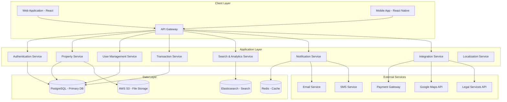

# Design Document

## Overview

The EU Real Estate Portal is designed as a modern, scalable web application that serves as a comprehensive digital marketplace for European property transactions. The platform leverages advanced AI technology, cloud infrastructure, and modern web technologies to provide an integrated solution for property seekers, estate agents, landlords, and property developers across multiple European markets.

The system architecture follows a microservices approach with a React-based frontend, Node.js backend services, and cloud-native deployment on AWS. The platform emphasizes security, performance, multilingual support, and EU regulatory compliance while providing an intuitive user experience across all devices and languages.

## Architecture

### High-Level Architecture



### Technology Stack

**Frontend:**
- React 18 with TypeScript for web application
- React Native for mobile applications
- Material-UI for consistent design system
- Redux Toolkit for state management
- React Query for server state management

**Backend:**
- Node.js with Express.js framework
- TypeScript for type safety
- JWT for authentication
- Prisma ORM for database operations
- Bull Queue for background job processing

**Database & Storage:**
- PostgreSQL for primary data storage
- Elasticsearch for search functionality
- Redis for caching and session storage
- AWS S3 for file and image storage

**Infrastructure:**
- AWS ECS for container orchestration
- AWS RDS for managed PostgreSQL
- AWS ElastiCache for managed Redis
- AWS CloudFront for CDN
- AWS Route 53 for DNS management

## Components and Interfaces

### Core Components

#### 1. Authentication Service
**Purpose:** Handles user authentication, authorization, and session management

**Key Features:**
- JWT-based authentication
- Role-based access control (RBAC)
- Multi-factor authentication support
- OAuth integration for social login
- Password reset and account recovery

**API Endpoints:**
- `POST /auth/login` - User login
- `POST /auth/register` - User registration
- `POST /auth/refresh` - Token refresh
- `POST /auth/logout` - User logout
- `POST /auth/forgot-password` - Password reset request

#### 2. Property Service
**Purpose:** Manages property listings, details, and related operations

**Key Features:**
- Property CRUD operations
- Image and document upload
- Property status management
- Listing validation and verification
- Property categorization and tagging

**API Endpoints:**
- `GET /properties` - List properties with filters
- `POST /properties` - Create new property listing
- `GET /properties/:id` - Get property details
- `PUT /properties/:id` - Update property listing
- `DELETE /properties/:id` - Remove property listing

#### 3. User Management Service
**Purpose:** Handles user profiles, preferences, and account management

**Key Features:**
- User profile management
- Preference settings
- Saved searches and favorites
- User verification and KYC
- Communication preferences

**API Endpoints:**
- `GET /users/profile` - Get user profile
- `PUT /users/profile` - Update user profile
- `GET /users/preferences` - Get user preferences
- `PUT /users/preferences` - Update preferences
- `GET /users/favorites` - Get saved properties

#### 4. Search & Analytics Service
**Purpose:** Provides advanced search capabilities and market analytics

**Key Features:**
- Elasticsearch-powered search
- AI-driven property recommendations
- Market trend analysis
- Price prediction algorithms
- Comparative market analysis

**API Endpoints:**
- `GET /search/properties` - Advanced property search
- `GET /search/suggestions` - Search suggestions
- `GET /analytics/market-trends` - Market trend data
- `GET /analytics/price-predictions` - Price predictions
- `GET /analytics/area-insights` - Area-specific insights

#### 5. Transaction Service
**Purpose:** Manages property transactions and related processes

**Key Features:**
- Offer management
- Transaction workflow tracking
- Document management
- Payment processing integration
- Legal compliance checks

**API Endpoints:**
- `POST /transactions/offers` - Submit property offer
- `GET /transactions/:id` - Get transaction details
- `PUT /transactions/:id/status` - Update transaction status
- `POST /transactions/:id/documents` - Upload transaction documents
- `GET /transactions/user/:userId` - Get user transactions

#### 6. Localization Service
**Purpose:** Handles multilingual content and regional customization

**Key Features:**
- Translation management for UI and content
- Regional formatting for dates, numbers, and currencies
- Country-specific property types and amenities
- Legal document templates per jurisdiction
- Cultural adaptation of user interfaces

**API Endpoints:**
- `GET /i18n/translations/:locale` - Get translations for locale
- `GET /i18n/formats/:country` - Get formatting rules for country
- `GET /i18n/property-types/:country` - Get localized property types
- `POST /i18n/translations` - Update translation content
- `GET /i18n/supported-locales` - Get list of supported locales

### Interface Specifications

#### Property Data Model
```typescript
interface Property {
  id: string;
  title: string;
  description: string;
  price: number;
  currency: string;
  propertyType: PropertyType;
  listingType: ListingType;
  address: Address;
  features: PropertyFeatures;
  images: PropertyImage[];
  documents: PropertyDocument[];
  agent: Agent;
  status: PropertyStatus;
  createdAt: Date;
  updatedAt: Date;
}

interface Address {
  street: string;
  city: string;
  postcode: string;
  county: string;
  country: string;
  coordinates: {
    latitude: number;
    longitude: number;
  };
}

interface PropertyFeatures {
  bedrooms: number;
  bathrooms: number;
  receptionRooms: number;
  floorArea: number;
  garden: boolean;
  parking: boolean;
  furnished: boolean;
  petFriendly: boolean;
  amenities: string[];
}
```

#### User Data Model
```typescript
interface User {
  id: string;
  email: string;
  firstName: string;
  lastName: string;
  phone: string;
  role: UserRole;
  profile: UserProfile;
  preferences: UserPreferences;
  verification: UserVerification;
  createdAt: Date;
  updatedAt: Date;
}

interface UserProfile {
  avatar: string;
  bio: string;
  company: string;
  website: string;
  socialLinks: SocialLinks;
}

interface UserPreferences {
  notifications: NotificationPreferences;
  searchCriteria: SearchCriteria;
  privacy: PrivacySettings;
}
```

## Data Models

### Database Schema Design

#### Core Tables

**users**
- Primary user account information
- Authentication credentials
- Profile data and preferences
- Role-based permissions

**properties**
- Property listing details
- Location and address information
- Features and amenities
- Pricing and availability

**property_images**
- Image metadata and storage references
- Image ordering and categorization
- Alt text for accessibility

**transactions**
- Transaction workflow tracking
- Offer and negotiation history
- Document references
- Status and milestone tracking

**searches**
- Saved search criteria
- Search history and analytics
- User preference learning

**notifications**
- User notification preferences
- Notification delivery tracking
- Template management

#### Relationships

```sql
-- Users can have multiple properties (agents/landlords)
users (1) -> (many) properties

-- Properties can have multiple images
properties (1) -> (many) property_images

-- Users can have multiple saved searches
users (1) -> (many) searches

-- Users can favorite multiple properties
users (many) <-> (many) properties (favorites)

-- Transactions involve users and properties
users (many) -> (many) transactions
properties (1) -> (many) transactions

-- Users can have multiple notifications
users (1) -> (many) notifications
```

## Error Handling

### Error Response Format
```typescript
interface ErrorResponse {
  error: {
    code: string;
    message: string;
    details?: any;
    timestamp: string;
    requestId: string;
  };
}
```

### Error Categories

**Validation Errors (400)**
- Invalid input data
- Missing required fields
- Format validation failures

**Authentication Errors (401)**
- Invalid credentials
- Expired tokens
- Insufficient permissions

**Authorization Errors (403)**
- Access denied
- Role-based restrictions
- Resource ownership violations

**Not Found Errors (404)**
- Resource not found
- Invalid endpoints
- Deleted resources

**Server Errors (500)**
- Database connection issues
- External service failures
- Unexpected system errors

### Error Handling Strategy

1. **Client-Side Error Handling**
   - User-friendly error messages
   - Retry mechanisms for transient errors
   - Graceful degradation for non-critical features

2. **Server-Side Error Handling**
   - Comprehensive error logging
   - Error monitoring and alerting
   - Automatic error recovery where possible

3. **Error Monitoring**
   - Integration with error tracking services (Sentry)
   - Real-time error alerts
   - Error trend analysis and reporting

## Testing Strategy

### Testing Pyramid

#### Unit Tests (70%)
- Individual function and component testing
- Mock external dependencies
- High code coverage (>90%)
- Fast execution and feedback

**Tools:** Jest, React Testing Library, Supertest

#### Integration Tests (20%)
- API endpoint testing
- Database integration testing
- Service-to-service communication
- End-to-end workflow testing

**Tools:** Jest, Testcontainers, Postman/Newman

#### End-to-End Tests (10%)
- Critical user journey testing
- Cross-browser compatibility
- Mobile responsiveness testing
- Performance testing

**Tools:** Playwright, Cypress, Lighthouse CI

### Testing Environments

**Development Environment**
- Local testing with Docker containers
- Mock external services
- Test data seeding and cleanup

**Staging Environment**
- Production-like environment
- Real external service integrations
- Performance and load testing

**Production Environment**
- Smoke tests after deployments
- Health checks and monitoring
- A/B testing capabilities

### Continuous Testing

1. **Pre-commit Hooks**
   - Lint and format checks
   - Unit test execution
   - Type checking

2. **CI/CD Pipeline**
   - Automated test execution
   - Code quality gates
   - Security vulnerability scanning

3. **Monitoring and Alerting**
   - Application performance monitoring
   - Error rate tracking
   - User experience monitoring

### Test Data Management

- **Synthetic Data Generation**
  - Realistic property data
  - User account variations
  - Transaction scenarios

- **Data Privacy**
  - No production data in testing
  - GDPR-compliant test data
  - Secure data handling practices

- **Test Environment Isolation**
  - Separate databases per environment
  - Independent external service mocks
  - Clean state between test runs