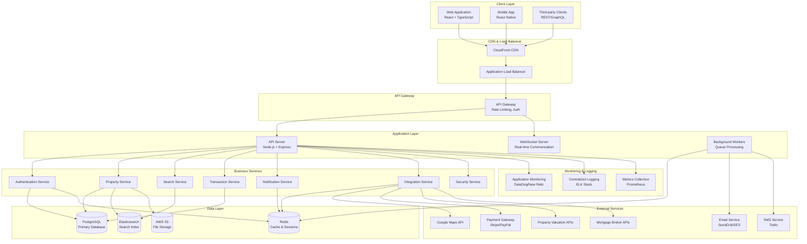
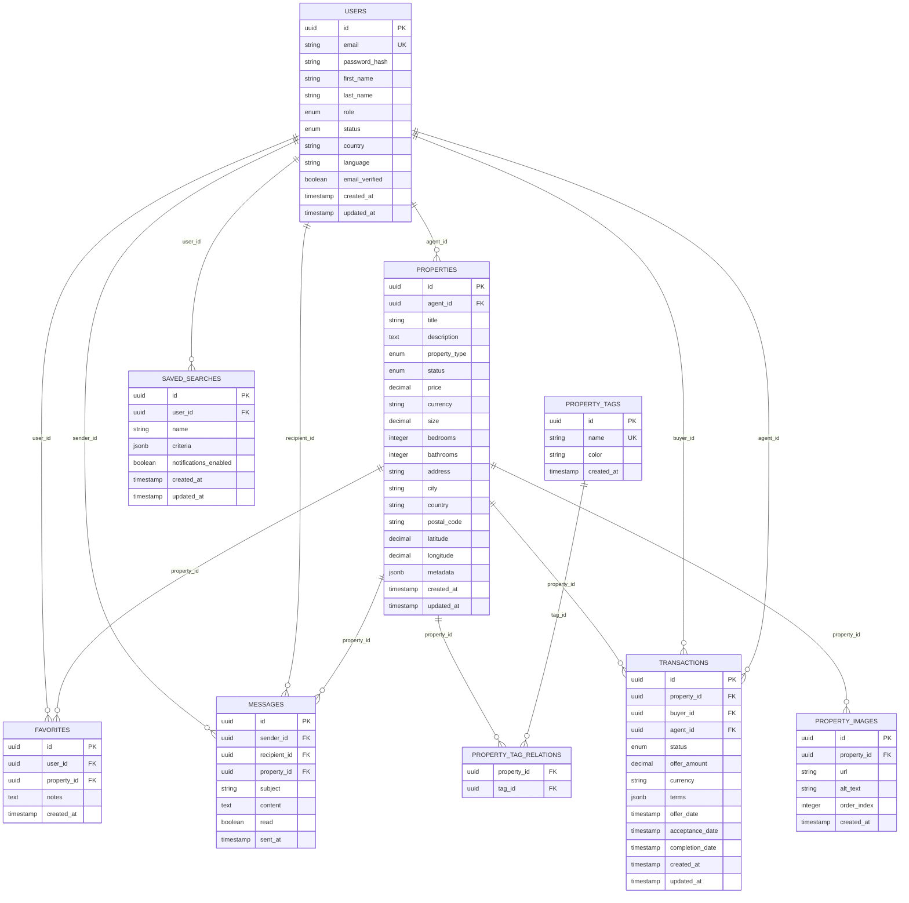
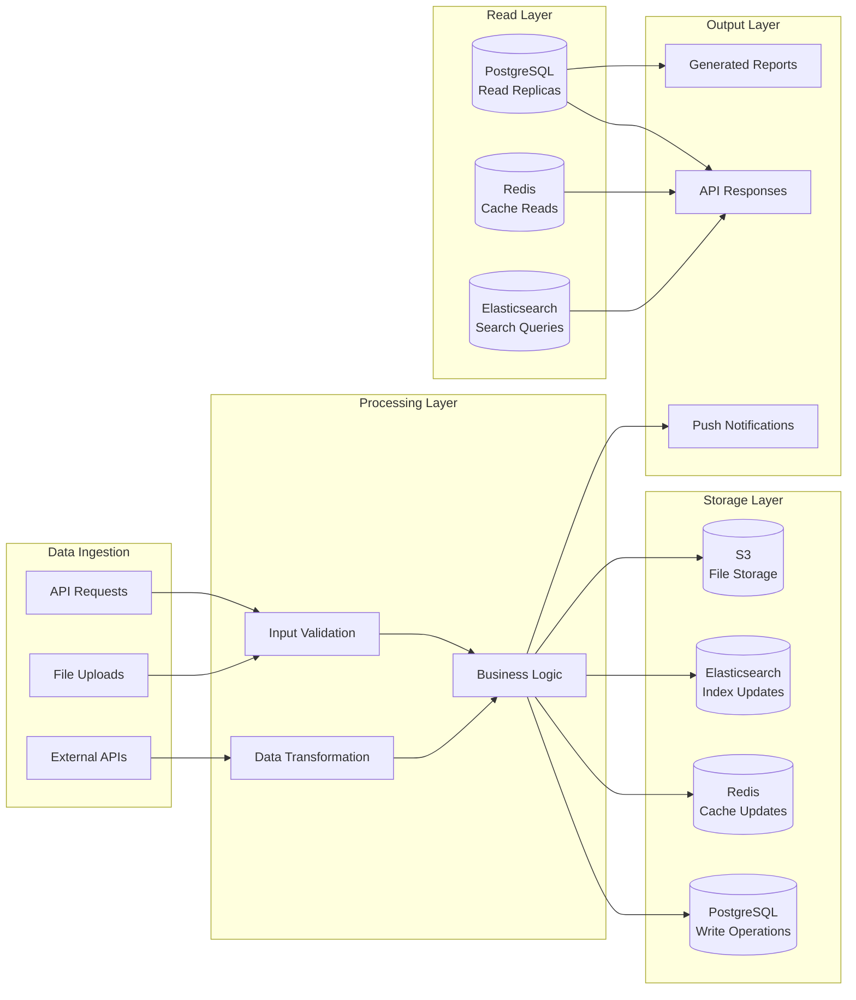
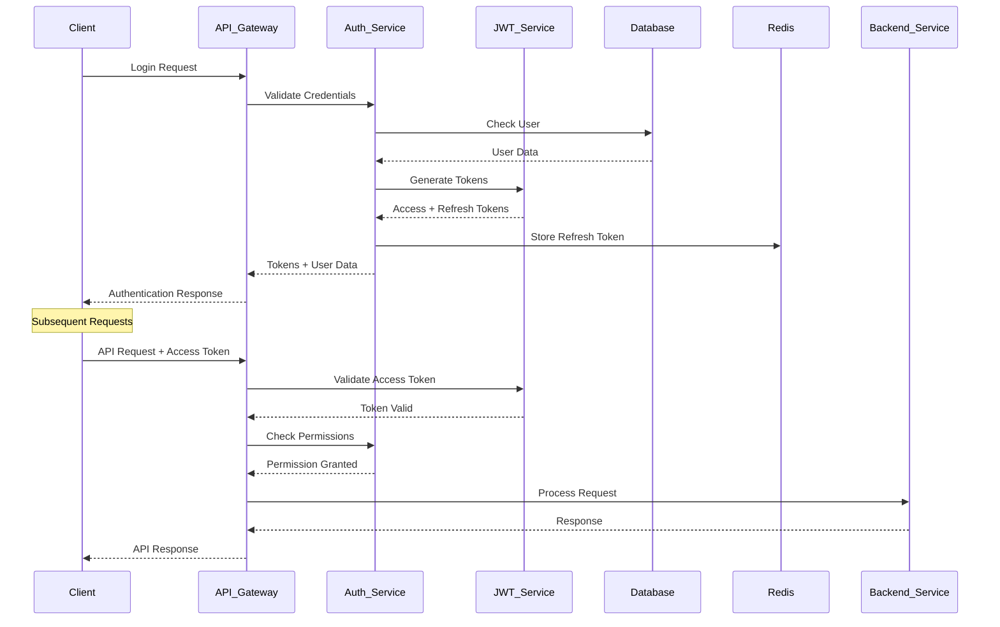
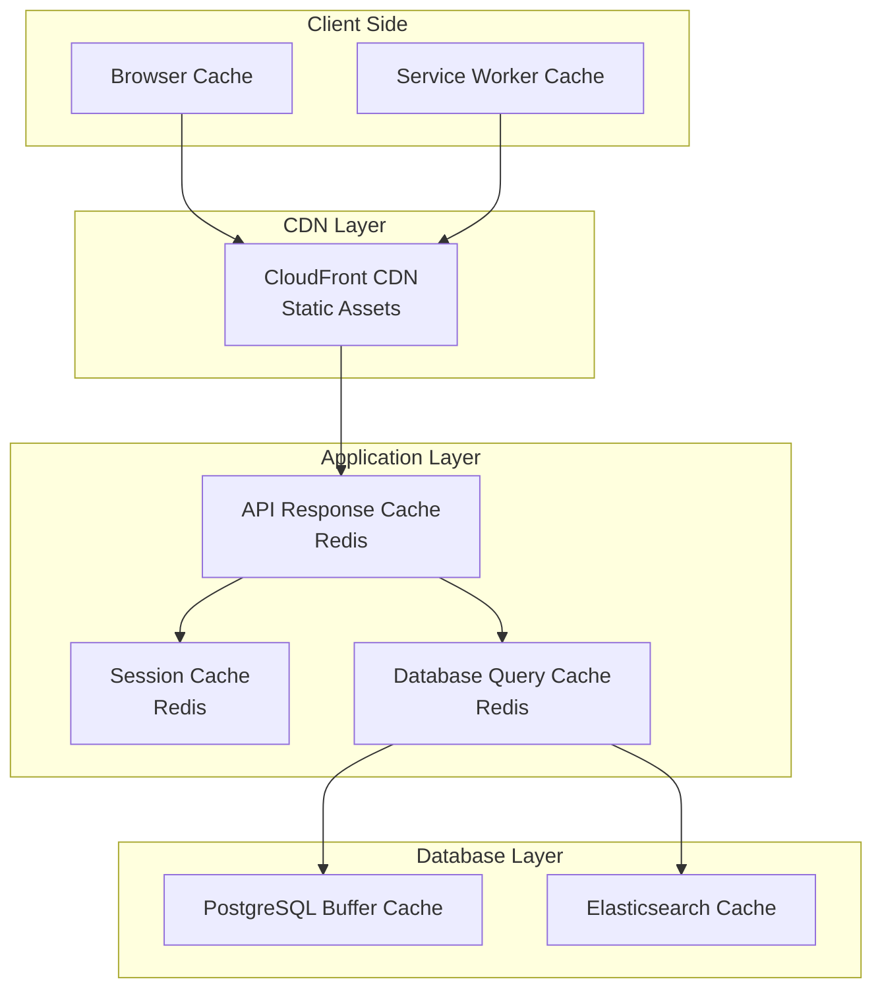
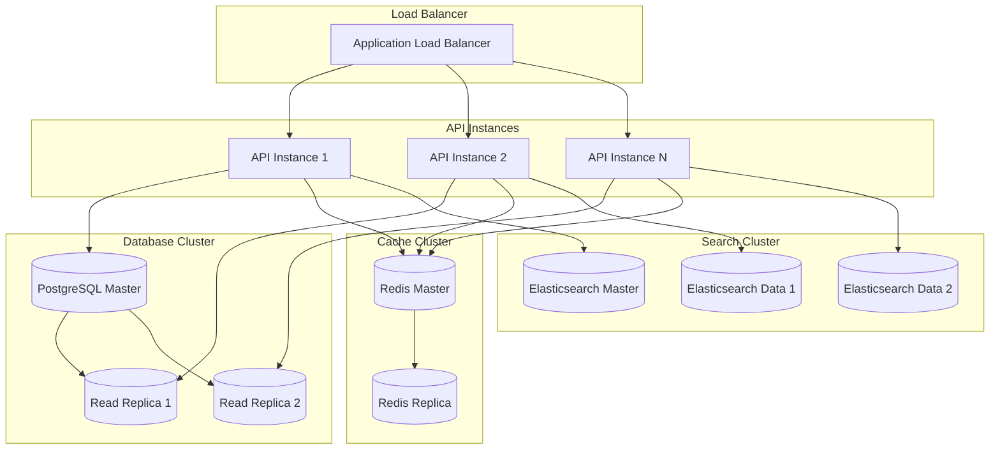
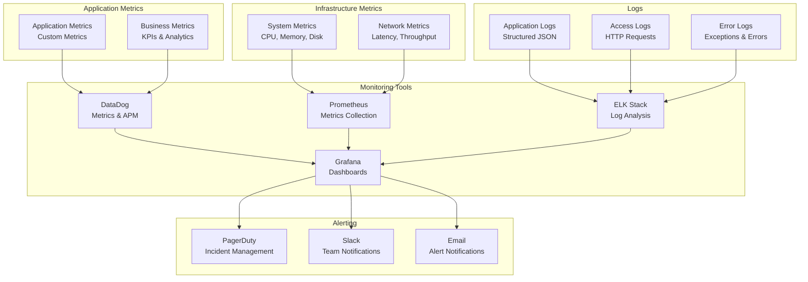
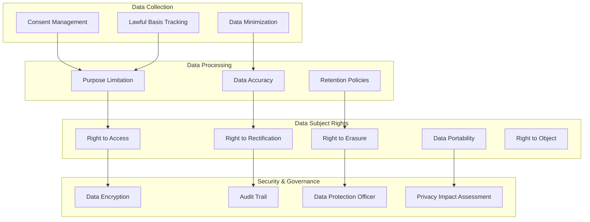

# EU Real Estate Portal - System Architecture

## Overview

The EU Real Estate Portal is a comprehensive, multi-tenant real estate platform designed to serve the European market. The system follows a modern microservices-inspired architecture with a monorepo structure, emphasizing scalability, maintainability, and regulatory compliance across multiple EU jurisdictions.

## Architecture Principles

### Core Principles
1. **Scalability**: Horizontal scaling capabilities for high traffic
2. **Security**: GDPR compliance and multi-layer security
3. **Performance**: Sub-second response times and efficient caching
4. **Reliability**: 99.9% uptime with fault tolerance
5. **Maintainability**: Clean code, comprehensive testing, and documentation
6. **Internationalization**: Multi-language and multi-currency support

### Design Patterns
- **Repository Pattern**: Data access abstraction
- **Service Layer Pattern**: Business logic encapsulation
- **Middleware Pattern**: Cross-cutting concerns
- **Observer Pattern**: Event-driven notifications
- **Factory Pattern**: Object creation and configuration

## System Architecture Diagram

## Technology Stack

### Frontend
- **Framework**: React 18 with TypeScript
- **State Management**: Redux Toolkit + RTK Query
- **UI Library**: Material-UI (MUI) v5
- **Styling**: Emotion (CSS-in-JS)
- **Build Tool**: Vite
- **Testing**: Jest + React Testing Library
- **Internationalization**: react-i18next

### Backend
- **Runtime**: Node.js 18+
- **Framework**: Express.js with TypeScript
- **Authentication**: JWT with refresh tokens
- **Validation**: Joi schema validation
- **Documentation**: OpenAPI/Swagger
- **Testing**: Jest + Supertest
- **Process Management**: PM2

### Database & Storage
- **Primary Database**: PostgreSQL 14+
- **ORM**: Prisma
- **Cache**: Redis 6+
- **Search Engine**: Elasticsearch 8+
- **File Storage**: AWS S3
- **CDN**: AWS CloudFront

### Infrastructure
- **Container Platform**: Docker + Docker Compose
- **Orchestration**: AWS ECS/EKS
- **Load Balancer**: AWS Application Load Balancer
- **Monitoring**: DataDog/New Relic
- **Logging**: ELK Stack (Elasticsearch, Logstash, Kibana)
- **CI/CD**: GitHub Actions

## Data Architecture

### Database Schema Overview

### Data Flow Architecture

## Security Architecture

### Authentication & Authorization Flow

### Security Layers

1. **Network Security**
   - HTTPS/TLS 1.3 encryption
   - WAF (Web Application Firewall)
   - DDoS protection
   - IP whitelisting for admin functions

2. **Application Security**
   - JWT-based authentication
   - Role-based access control (RBAC)
   - Input validation and sanitization
   - SQL injection prevention
   - XSS protection
   - CSRF protection

3. **Data Security**
   - Encryption at rest (AES-256)
   - Encryption in transit (TLS 1.3)
   - PII data masking
   - Secure key management (AWS KMS)
   - Regular security audits

4. **Infrastructure Security**
   - VPC with private subnets
   - Security groups and NACLs
   - IAM roles and policies
   - Container security scanning
   - Regular penetration testing

## Performance Architecture

### Caching Strategy

### Performance Optimization Strategies

1. **Frontend Optimization**
   - Code splitting and lazy loading
   - Image optimization and WebP format
   - Bundle size optimization
   - Service worker for offline functionality
   - Virtual scrolling for large lists

2. **Backend Optimization**
   - Database query optimization
   - Connection pooling
   - Async processing for heavy operations
   - Response compression (gzip/brotli)
   - API response caching

3. **Database Optimization**
   - Proper indexing strategy
   - Query optimization
   - Read replicas for scaling
   - Partitioning for large tables
   - Connection pooling

4. **Infrastructure Optimization**
   - Auto-scaling groups
   - Load balancing
   - CDN for static assets
   - Geographic distribution
   - Container optimization

## Scalability Architecture

### Horizontal Scaling Strategy

### Auto-scaling Configuration

1. **Application Scaling**
   - CPU utilization > 70%
   - Memory utilization > 80%
   - Request queue depth > 100
   - Response time > 2 seconds

2. **Database Scaling**
   - Read replica auto-scaling
   - Connection pool monitoring
   - Query performance monitoring
   - Storage auto-scaling

3. **Cache Scaling**
   - Memory utilization monitoring
   - Hit rate optimization
   - Cluster scaling based on load
   - Failover configuration

## Monitoring & Observability

### Monitoring Stack

### Key Metrics & Alerts

1. **Application Metrics**
   - Response time (p95 < 500ms)
   - Error rate (< 0.1%)
   - Throughput (requests/second)
   - Active users
   - Feature usage

2. **Infrastructure Metrics**
   - CPU utilization (< 80%)
   - Memory usage (< 85%)
   - Disk usage (< 90%)
   - Network latency
   - Database connections

3. **Business Metrics**
   - Property listings created
   - User registrations
   - Search queries
   - Transaction completions
   - Revenue metrics

## Deployment Architecture

### CI/CD Pipeline

```mermaid
graph LR
    subgraph "Development"
        DEV_CODE[Code Changes]
        DEV_COMMIT[Git Commit]
        DEV_PR[Pull Request]
    end

    subgraph "CI Pipeline"
        CI_TRIGGER[GitHub Actions Trigger]
        CI_TEST[Run Tests]
        CI_BUILD[Build Applications]
        CI_SECURITY[Security Scan]
        CI_QUALITY[Code Quality Check]
    end

    subgraph "CD Pipeline"
        CD_STAGING[Deploy to Staging]
        CD_E2E[E2E Tests]
        CD_APPROVAL[Manual Approval]
        CD_PRODUCTION[Deploy to Production]
    end

    subgraph "Monitoring"
        MONITOR_HEALTH[Health Checks]
        MONITOR_ROLLBACK[Automatic Rollback]
    end

    DEV_CODE --> DEV_COMMIT
    DEV_COMMIT --> DEV_PR
    DEV_PR --> CI_TRIGGER
    CI_TRIGGER --> CI_TEST
    CI_TEST --> CI_BUILD
    CI_BUILD --> CI_SECURITY
    CI_SECURITY --> CI_QUALITY
    CI_QUALITY --> CD_STAGING
    CD_STAGING --> CD_E2E
    CD_E2E --> CD_APPROVAL
    CD_APPROVAL --> CD_PRODUCTION
    CD_PRODUCTION --> MONITOR_HEALTH
    MONITOR_HEALTH --> MONITOR_ROLLBACK
```

### Environment Configuration

1. **Development Environment**
   - Local Docker containers
   - Hot reloading enabled
   - Debug logging
   - Test data seeding

2. **Staging Environment**
   - Production-like infrastructure
   - Automated testing
   - Performance testing
   - Security scanning

3. **Production Environment**
   - High availability setup
   - Auto-scaling enabled
   - Monitoring and alerting
   - Backup and disaster recovery

## Compliance & Regulatory Architecture

### GDPR Compliance

### Multi-Jurisdiction Support

1. **Country-Specific Features**
   - Legal document templates
   - Property disclosure requirements
   - Currency and tax calculations
   - Local payment methods

2. **Regulatory Compliance**
   - GDPR (EU-wide)
   - National data protection laws
   - Financial services regulations
   - Real estate licensing requirements

3. **Localization**
   - Multi-language support
   - Cultural adaptations
   - Local business practices
   - Regional customer support

## Future Architecture Considerations

### Planned Enhancements

1. **Microservices Migration**
   - Service decomposition strategy
   - API gateway implementation
   - Service mesh adoption
   - Event-driven architecture

2. **AI/ML Integration**
   - Property valuation models
   - Recommendation engines
   - Fraud detection systems
   - Chatbot integration

3. **Mobile-First Architecture**
   - Progressive Web App (PWA)
   - Native mobile applications
   - Offline-first capabilities
   - Push notification system

4. **Advanced Analytics**
   - Real-time analytics dashboard
   - Predictive analytics
   - Market trend analysis
   - User behavior analytics

### Technology Evolution

1. **Container Orchestration**
   - Kubernetes migration
   - Service mesh (Istio)
   - GitOps deployment
   - Multi-cloud strategy

2. **Database Evolution**
   - Multi-region replication
   - Event sourcing
   - CQRS implementation
   - Time-series data storage

3. **Security Enhancements**
   - Zero-trust architecture
   - Advanced threat detection
   - Automated security testing
   - Compliance automation

This architecture document serves as a living guide for the EU Real Estate Portal system. It should be updated regularly as the system evolves and new requirements emerge.